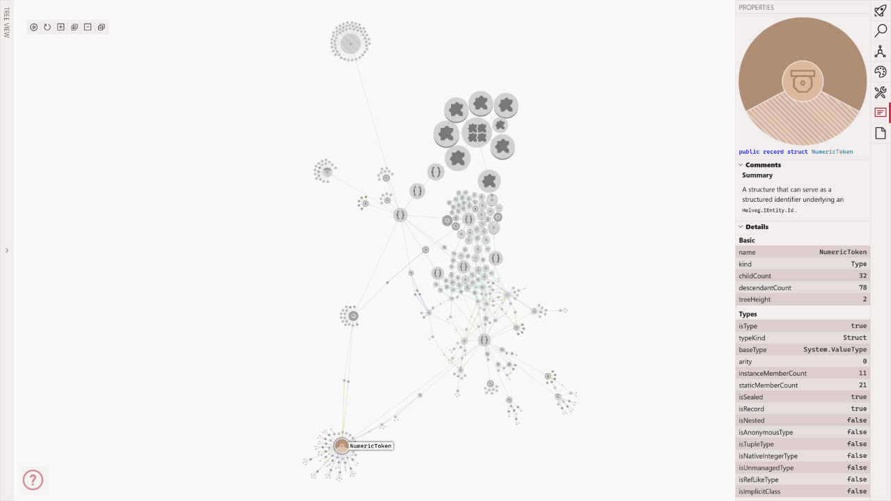
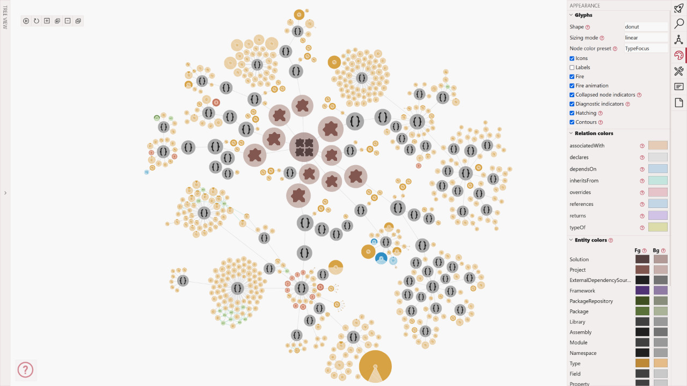
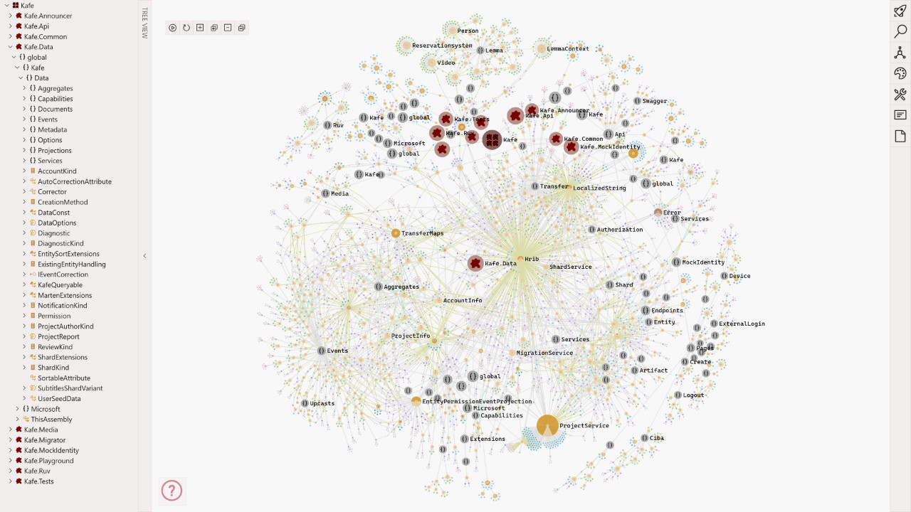
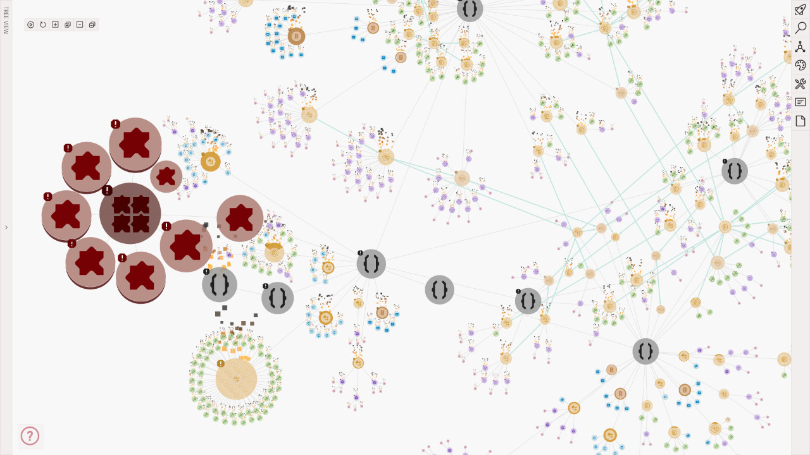

# Helveg

<a href="https://nuget.org">
    
</a>

<a href="https://gitlab.com/helveg/helveg/-/packages">
    
</a>

<a href="./LICENSE">
    
</a>

A prototype of a tool and an extensible API for the visualization of C# codebases.

* **[Docs](https://helveg.net/)**
* **[Samples](https://helveg.net/samples/)**

<a href="./screenshots/helveg_node_with_metadata.png" title="Node with metadata">
    
</a>
<a href="./screenshots/kafe_data_types.png" title="Kafe.Data types">
    
</a>
<a href="./screenshots/kafe_solution.png" title="KAFE solution">
    
</a>
<a href="./screenshots/helveg_with_errors.png" title="Helveg with errors">
    
</a>


## Installing

```bash
dotnet tool install --global helveg
```


## Usage

To produce a diagram of a codebase, navigate into a directory with a Visual Studio Solution file or a MSBuild C# project file and run:

```bash
helveg
```

Alternatively, to produce a diagram of a solution in `C:\dev\my-code\MyCode.sln`, run:

```bash
helveg 'C:\dev\my-code\MyCode.sln'
```

For a complete list of command-line options, see:

```bash
helveg --help
```

**Note:** If you don't have any C# codebase at hand, run Helveg on itself or on one of the simple samples in the `./samples` directory.

Upon completion, Helveg produces a single `.html` file.
This file contains the interactive diagram.
Open it in an up-to-date browser.
For information on how to use the user interface, see `supplementary_meterial.pdf` or the Help panel (denoted by an encircled question mark) within the interface itself.


## Limitations

The visualized codebase must be able to build using `dotnet build`. Codebases relying on .NET Core and .NET 5+ should be fine. However, you may encounter issues when visualizing projects relying on the old .NET Framework, such as old-style ASP.NET projects and WPF applications.


## Building

### Prerequisites

* .NET 9.0 or newer
* Node 22.4.0 or newer
* an up-to-date web browser
* git (optional)
* Windows 11 or Ubuntu 22.04 or newer


### Using a script (on Ubuntu)

To install Helveg and let it produce a visualization of itself, run the `build.sh` command in the repo's root directory. The resulting file will be named `index.html`. This script has been tested on Ubuntu 22.04.


### Manually

To build Helveg from its source code, do the following:

1. Make sure you have installed the prerequisites listed above.
2. Make sure your computer is connected to the internet.
3. Open a command-line or a terminal in the root of the repository.
4. Restore .NET tools:
    ```bash
    dotnet tool restore
    ```
5. Enable `corepack` (Node's manager of package managers):
    ```bash
    corepack enable
    ```
6. Install the `pnpm` package manager:
    ```bash
    corepack prepare pnpm@latest --activate
    ```
7. Install client dependencies: 
    ```bash
    pnpm install
    ```
8. Build client scripts:
    ```bash
    pnpm run build
    ```
9. Pack the .NET solution:
    ```bash
    dotnet pack Helveg.sln -o artifacts -c Release
    ```
10. Make sure no prior version of Helveg is installed:
    ```bash
    dotnet tool uninstall --global helveg
    ```
11. Install the newly built Helveg:
    ```bash
    dotnet tool install --global --add-source "./artifacts" --version "0.0.0-local" helveg
    ```


### About version strings

This repository uses [GitVersion](https://gitversion.net/) to produce NuGet packages with correct semantic version strings.
If you obtained Helveg's code repository without its history (i.e. the `.git` folder), you won't be able to use GitVersion and all packages will have the `0.0.0-local` fallback version.

If the `.git` directory is present and you have `git` installed on your computer, you can generate NuGet packages with correct version strings by following steps 1. - 7. as above and then the following:

8. Set the version string in `package.json` files:
    ```bash
    pnpm run git-version
    ```
9. Build client scripts:
    ```bash
    pnpm run build
    ```
10. Pack the .NET solution:
    ```bash
    dotnet pack Helveg.sln -o artifacts -c Release -p:AllowGitVersion=true
    ```
11. Make sure no prior version of Helveg is installed:
    ```bash
    dotnet tool uninstall --global helveg
    ```
12. Look into the `./artifacts` directory and make note of `<version>` in the filenames.
    For example in `helveg.42.0.0-answer.nupkg`, `<version>` is `42.0.0-answer`.
13. Install the newly built Helveg:
    ```bash
    dotnet tool install --global --add-source "./artifacts" --version "<version>" helveg
    ```


## Dependencies

This software has many dependencies. You do not need to install these explicitly. See Build Instructions above. These are the most significant dependencies:

**Back-end**

* [MSBuild](https://github.com/dotnet/msbuild)
* [Roslyn](https://github.com/dotnet/roslyn/)
* [NuGet](https://nuget.org/)

**Front-end**

* [Sigma.js](https://github.com/jacomyal/sigma.js)
* [Graphology](https://github.com/graphology/graphology)
* [Svelte](https://svelte.dev/)


## Reproducing the Screenshots

**Note:** It may not be possible to replicate the screenshots exactly due to the interactive nature of the visualization.

To reproduce the screenshots shown above and contained in the `screenshots` directory, follow these steps:

**`helveg_node_with_metadata.png`**

1. Run the command-line tool in the folder with the codebase  with these parameters:
    - Codebase: https://gitlab.com/helveg/helveg/ (this repo)
    - Command: `helveg --preset Docs -p TargetFramework=net8.0 --out-file index.html --mode SingleFile`
    - _The output may differ based on the visualized branch and commit._
2. Open the `index.html` file with an up-to-date browser.
3. In the _Appearance_ panel, disable labels.
4. Explore the codebase (expand nodes by double clicking them).
5. Adjust the position of the nodes manually (by holding _Shift_ and dragging them).
6. Select the `NumericToken` node and open the _Properties_ panel.
7. The result should look _similar_ to the screenshot.

**`helveg_with_error.png`**

1. Follow the same instructions as with `helveg_node_with_metadata.png`. However, delete an important type to generate a large number of errors, for example the `NumericToken` node.
2. Open the `index.html` file with an up-to-date browser.
3. Expand all nodes.
4. Zoom in on the nodes with the errors.
5. The result should look _similar_ to the screenshot.

**`kafe_data_types.png`**

1. Run the command-line tool in the folder with the codebase with these parameters:
    - Codebase: https://gitlab.fi.muni.cz/legtvar/kafe
    - Commit SHA: `52343b6f006b647886c981eb0d7abe57cfc3f0a0`
    - Command: `helveg --preset Dev -p TargetFramework=net9.0 --out-file index.html -m SingleFile`
    - _Please note that to visualize KAFE, you need to install .NET 9.0._
2. Open the `index.html` file with an up-to-date browser.
3. In the _Appearance_ panel, disable labels.
4. In the _Quick Start_ panel, click _All types_.
5. The result should look _similar_ to the screenshot.

**`kafe_solution.png`**

1. Follow the same instructions as with `kafe_data_types.png`.
2. Open the `index.html` file with an up-to-date browser.
3. In the _Quick Start_ panel, click _Bird's-eye view_.
4. Close the _Quick Start_ panel by clicking on its tab again.
5. Open the _Tree View_ on the left side of the screen.
6. The result should look _similar_ to the screenshot.


## License

* The source code is licensed under the [BSD 3-Clause License](./LICENSE).
* Icons in `./packages/helveg-diagram/icons/vscode` are from the [`vscode-codicons` repository](https://github.com/microsoft/vscode-codicons), were created by Microsoft, and are licensed under the [Creative Commons Attribution 4.0 International Public License](https://creativecommons.org/licenses/by/4.0/legalcode).
* The ingredients used in the _CodePizza_ feature are based on a number of royalty-free images. A complete list can be found in [~/docs/codepizza.md](./codepizza.md).
